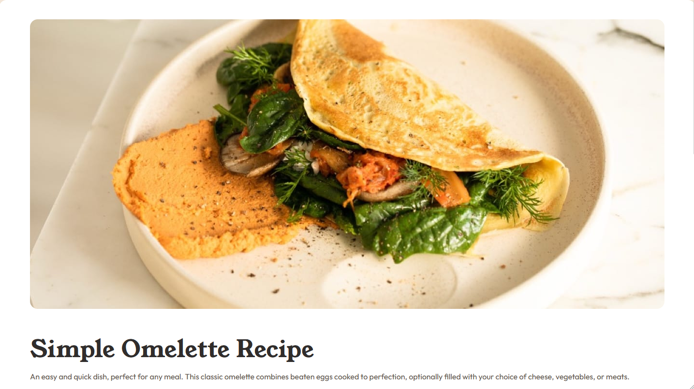
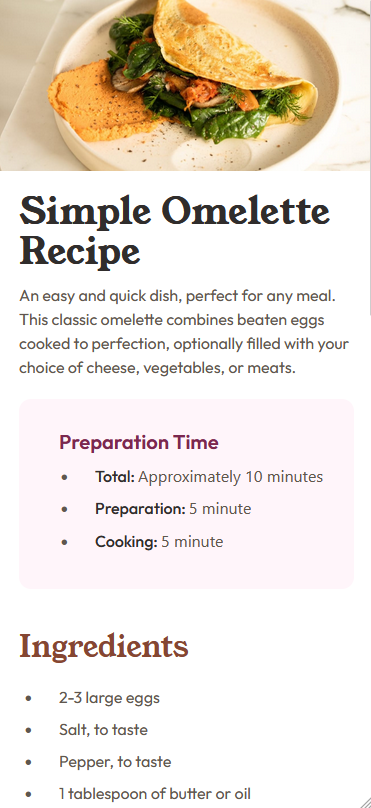

# Frontend Mentor - Recipe page solution

This is a solution to the [Recipe page challenge on Frontend Mentor](https://www.frontendmentor.io/challenges/recipe-page-KiTsR8QQKm). Frontend Mentor challenges help you improve your coding skills by building realistic projects. 

## Table of contents

- [Overview](#overview)
  - [Screenshot](#screenshot)
- [My process](#my-process)
  - [Built with](#built-with)
  - [What I learned](#what-i-learned)
  - [Continued development](#continued-development)
  - [Useful resources](#useful-resources)
- [Author](#author)

**Note: Delete this note and update the table of contents based on what sections you keep.**

## Overview

### Screenshot
Desktop Preview

Mobile Preview

## My process

### Built with

- Semantic HTML5 markup
- Tailwind CSS
- Mobile-first workflow

### What I learned

From this challenge I learned to use Tailwind CSS, where tailwind CSS is something that I have just used after all this time I have continuously used Bootstrap, I learned it from the installation stage to configuration to how to use the classes in Tailwind CSS.

### Continued development

In the future, I plan to add more advanced features such as:
1. Landing page
2. Recipes Categories
3. Most viewed recipes

### Useful resources

- [Tailwind CSS Documentation](https://tailwindcss.com/docs/installation) - This official website of Tailwind CSS is very helpful for me in understanding the use of Tailwind CSS.

## Author

- Frontend Mentor - [@Mnaqor66](https://www.frontendmentor.io/profile/Mnaqor66)
- Twitter - [@NaufalAbqori3](https://x.com/NaufalAbqori3)
